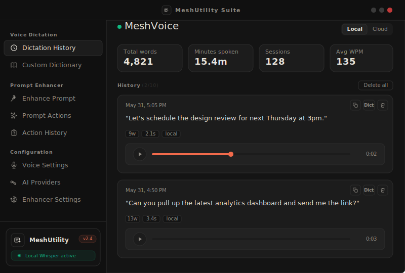
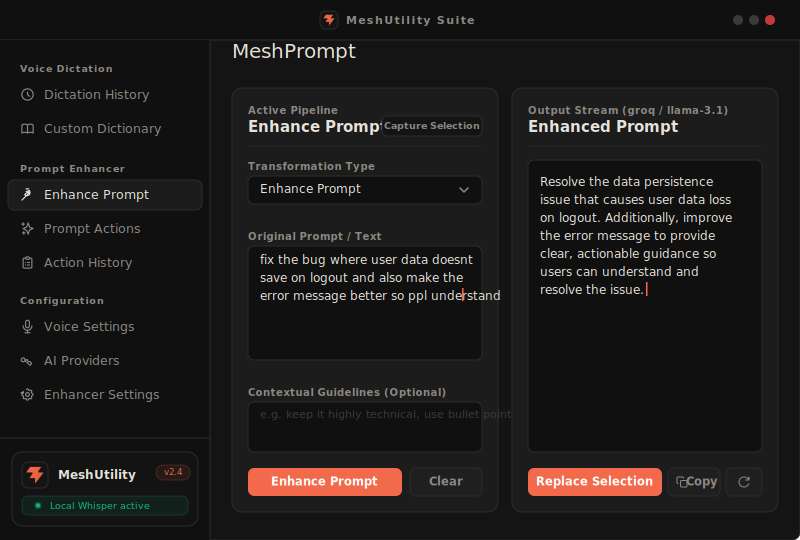
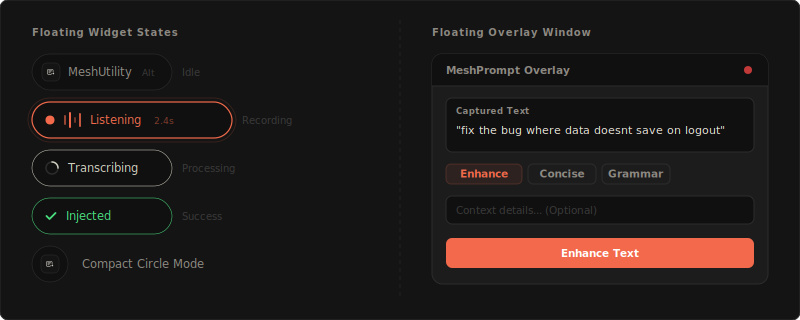

<div align="center">


# MeshUtility

**Open-source desktop utility for AI-powered voice dictation and prompt enhancement.**

Built with Tauri 2, React, and Rust. Works fully offline with local Whisper models or online via Groq, OpenAI, Anthropic, and more.

<br/>

[](LICENSE)
[](https://tauri.app)
[](https://github.com/Jenesh11/MeshUtility/releases)

</div>

---

## Overview

MeshUtility is a tray-resident desktop app combining two powerful tools:

**Voice Dictation** — Hold your hotkey, speak, release. Your words are transcribed and injected into any text field, in any app. Supports local offline Whisper models and cloud Groq Whisper API.

**Prompt Enhancer** — Select text anywhere, hit your shortcut, and an AI rewrites it. Supports Groq, OpenAI, Anthropic, Gemini, Mistral, and any OpenAI-compatible API. Results stream directly in a floating overlay.

---

## Interface

<div align="center">

### Main Window



<br/>

### Prompt Enhancer



<br/>

### Floating Overlay and Widget



</div>

---

## Features

### Voice Dictation
- Push-to-talk or toggle recording mode with a configurable global hotkey (`Alt+Space` default)
- Local offline transcription via whisper.cpp and sherpa-onnx parakeet model
- Cloud transcription via the Groq Whisper API (requires API key)
- Custom pronunciation dictionary for domain-specific terms and names
- Full transcription history with word count, duration, and timestamp
- Microphone selection, sensitivity control, and device status checks
- Partial transcription preview while recording (Hinglish / multilingual)

### Prompt Enhancer
- Streaming AI output with support for Groq, OpenAI, Anthropic, Google Gemini, Mistral, and custom OpenAI-compatible endpoints
- Built-in prompt action library: Enhance, Make Concise, Fix Grammar, Translate, Summarize, and more
- Floating overlay window that activates on a global shortcut and captures selected text
- One-click copy or replace the selected text with the enhanced output
- Prompt action history with full input/output log
- Per-provider model selection, temperature, and token limit settings

### System
- Lives in the system tray — minimal resource usage when idle
- Borderless custom window with native drag support
- Automatic launch at Windows startup
- Close to tray behavior keeps the app running in the background
- Floating pill widget with animated state transitions (idle, listening, processing, done)
- Auto-update check via GitHub Releases
- All history and settings stored in a local SQLite database — no cloud sync, no telemetry

---

## Prerequisites

| Requirement | Version |
|---|---|
| Rust | 1.77 or later |
| Node.js | 20 or later |
| Tauri CLI | 2.x — install with `cargo install tauri-cli` |
| OS | Windows 10 or later (primary platform) |

macOS and Linux are partially supported. Some audio backend features may behave differently across platforms.

---

## Setup

### 1. Clone the repository

```bash
git clone https://github.com/Jenesh11/MeshUtility.git
cd MeshUtility
```

### 2. Install Node dependencies

```bash
npm install
```

### 3. Run in development mode

```bash
npm run tauri dev
```

### 4. Configure your API key

Once the app is running, open **Configuration > AI Providers** in the sidebar and enter your API key for the provider you want to use.

For cloud transcription, open **Configuration > Voice Settings** and enter your Groq API key. A free key is available at [console.groq.com](https://console.groq.com).

For local offline transcription, go to **Voice Settings**, select a Whisper model, and click Download. No API key is needed.

---

## Building for release

```bash
npm run tauri build
```

The installer and portable `.exe` are placed in `src-tauri/target/release/bundle/`.

---

## Project Structure

```
MeshUtility/
├── src/                          # React + TypeScript frontend
│   ├── App.tsx                   # Main window shell and sidebar navigation
│   ├── WidgetApp.tsx             # Floating pill widget root
│   ├── components/
│   │   ├── Dashboard.tsx         # Dictation history and stats
│   │   ├── PromptApp.tsx         # Prompt enhancer — full UI
│   │   ├── Settings.tsx          # Voice settings, hotkey, model, mic
│   │   ├── Widget.tsx            # Pill widget state machine (embedded view)
│   │   ├── DictionaryEditor.tsx  # Custom pronunciation dictionary
│   │   └── ResultPopup.tsx       # Transcription result popup card
│   ├── store/
│   │   └── appStore.ts           # Zustand state for recording and history
│   ├── lib/                      # Prompt enhancer logic: actions, client, types
│   └── styles-prompt.css         # Design tokens and component styles
├── src-tauri/                    # Rust backend (Tauri 2)
│   ├── src/
│   │   ├── main.rs               # App setup, commands, tray, shortcuts
│   │   ├── audio.rs              # CPAL audio capture and level emission
│   │   ├── transcription.rs      # Whisper and sherpa-onnx inference
│   │   ├── db.rs                 # SQLite — history, settings, dictionary
│   │   ├── injection.rs          # Text injection via clipboard and enigo
│   │   └── clipboard.rs          # Clipboard read/write with canary detection
│   └── tauri.conf.json           # Window definitions, deep-link schemes, icons
├── public/                       # Static assets — logos, icons
├── index.html                    # Main window entry
├── widget.html                   # Widget window entry
└── overlay.html                  # Overlay window entry
```

---

## Configuration Reference

All settings are saved locally in a SQLite database in the system app data folder. They can be changed from within the app at any time.

| Setting | Description | Default |
|---|---|---|
| Hotkey | Global shortcut to start and stop voice recording | `Alt+Space` |
| Recording mode | `push-to-talk` holds to record, `toggle` clicks to start and stop | `push-to-talk` |
| Transcription engine | `local` uses whisper.cpp offline, `cloud` uses Groq Whisper API | `local` |
| Selected model | Whisper model file downloaded to local storage | none |
| Language mode | `auto`, `en`, `hi`, or any ISO language code | `auto` |
| Sensitivity | Microphone input gain multiplier 0 to 1 | `0.5` |
| Groq API key | Required only when transcription engine is set to cloud | — |
| Prompt provider | `groq`, `openai`, `anthropic`, `gemini`, `mistral`, or `custom` | `groq` |
| Prompt model | Model ID string for the selected provider | `llama-3.1-8b-instant` |
| Temperature | Output randomness for the prompt enhancer 0 to 1 | `0.35` |
| Close to tray | Keep the app running when the window is closed | `true` |

---

## Keyboard Shortcuts

| Shortcut | Action |
|---|---|
| `Alt+Space` | Start or stop voice recording — configurable in Voice Settings |
| `Ctrl+Shift+Space` | Open the prompt enhancer overlay — configurable in Enhancer Settings |
| `Ctrl+Enter` | Enhance the current prompt in the overlay or main enhancer view |
| `Escape` | Dismiss the overlay or close the result popup |
| `Ctrl+C` | Copy the enhanced output to clipboard |

---

## Supported Providers

| Provider | Voice Transcription | Prompt Enhancement |
|---|---|---|
| Groq | Yes — Whisper API | Yes |
| OpenAI | No | Yes |
| Anthropic | No | Yes |
| Google Gemini | No | Yes |
| Mistral | No | Yes |
| Custom OpenAI-compatible | No | Yes |
| Local Whisper (offline) | Yes — no API key needed | No |

---

## Contributing

Pull requests are welcome. For significant changes, open an issue first to discuss the approach.

1. Fork the repository
2. Create a feature branch: `git checkout -b feature/my-change`
3. Commit your changes with a descriptive message
4. Open a pull request against `main`

Please match the existing code style. TypeScript uses React with Zustand for state. Rust follows the existing module structure in `src-tauri/src/`.

---

## License

MIT License — see [LICENSE](LICENSE) for full terms.

---

## Acknowledgments

- [Tauri](https://tauri.app) — framework for building native desktop apps with web frontends
- [whisper.cpp](https://github.com/ggerganov/whisper.cpp) — fast C++ inference for OpenAI Whisper models
- [sherpa-onnx](https://github.com/k2-fsa/sherpa-onnx) — ONNX speech recognition for the parakeet model
- [Groq](https://groq.com) — ultra-fast LLM and Whisper inference API
- [CPAL](https://github.com/RustAudio/cpal) — cross-platform audio I/O in Rust
